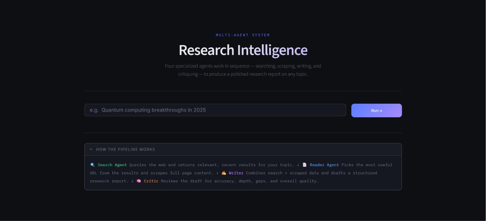
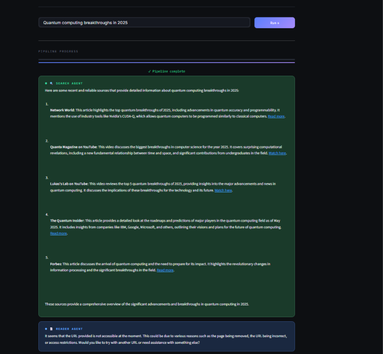
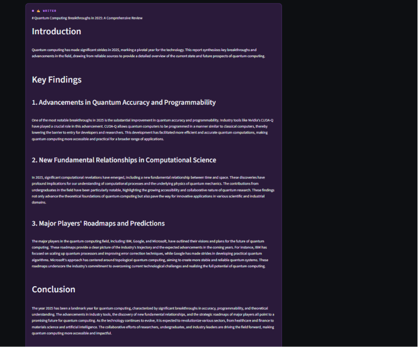
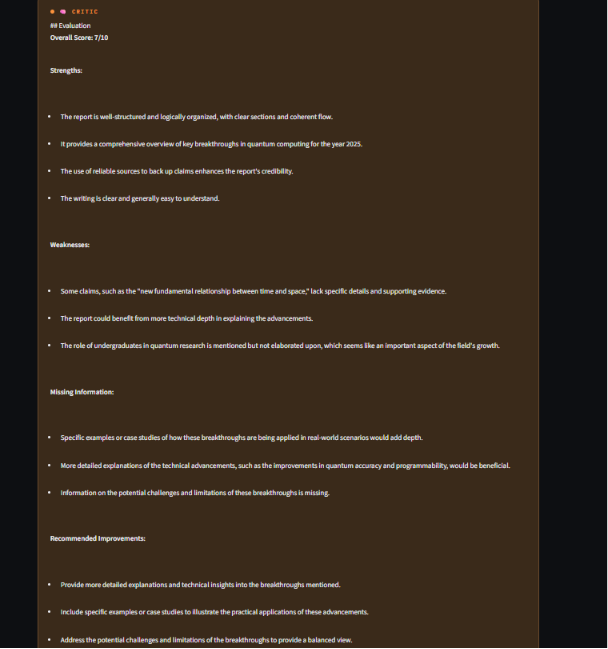

# 🔬 Multi-Agent Research System

An AI-powered **Multi-Agent Research System** built using **LangChain**, **Mistral AI**, and **Streamlit**. The application automates the research workflow by combining multiple specialized AI agents to search the web, extract relevant information, generate structured reports, and critically review the final output.

---

# 🚀 Features

* 🤖 Multi-Agent Architecture
* 🌐 Real-time Web Search using Tavily API
* 📄 Intelligent Web Scraping with BeautifulSoup
* ✍️ AI-powered Research Report Generation
* 🧐 Automated Report Review & Critique
* 🖥️ Interactive Streamlit Web Interface
* 🔗 LangChain Tool Calling
* 📑 Structured Markdown Reports
* 🧩 Modular & Easy-to-Extend Codebase

---

# 🏗️ System Architecture

```text
                   User Topic
                        │
                        ▼
             ┌─────────────────────┐
             │    Search Agent     │
             │ (Tavily Web Search) │
             └─────────────────────┘
                        │
                        ▼
             ┌─────────────────────┐
             │    Reader Agent     │
             │ (BeautifulSoup Web  │
             │      Scraper)       │
             └─────────────────────┘
                        │
                        ▼
             ┌─────────────────────┐
             │    Writer Chain     │
             │ Generates Report    │
             └─────────────────────┘
                        │
                        ▼
             ┌─────────────────────┐
             │    Critic Chain     │
             │ Reviews the Report  │
             └─────────────────────┘
                        │
                        ▼
               Final Research Report
```

---

# 🛠️ Tech Stack

* Python
* Streamlit
* LangChain
* Mistral AI
* Tavily Search API
* BeautifulSoup4
* Requests
* python-dotenv
* Rich

---

# 🧠 Concepts Used

* Multi-Agent Systems
* AI Agents
* LLM Tool Calling
* Prompt Engineering
* Web Search
* Web Scraping
* Research Automation
* Report Generation
* AI Self-Critique
* LangChain Pipelines

---

# 📂 Project Structure

```text
multi-agent-research-system/
│
├── app.py                 # Streamlit UI
├── agents.py              # Search & Reader Agents
├── tools.py               # Web Search & Scraping Tools
├── main.py                # Research Pipeline
├── requirements.txt
├── .env
└── README.md
```

---

# ⚙️ How It Works

1. The user enters a research topic.
2. The **Search Agent** searches the web using Tavily.
3. The **Reader Agent** selects and scrapes the most relevant webpage.
4. The **Writer Chain** generates a structured research report.
5. The **Critic Chain** reviews the report and provides detailed feedback.
6. The final report and evaluation are displayed through the Streamlit interface.

---

# 💻 Installation

Clone the repository

```bash
git clone https://github.com/your-username/multi-agent-research-system.git
```

Move into the project directory

```bash
cd multi-agent-research-system
```

Create a virtual environment

```bash
python -m venv venv
```

Activate the environment

### Windows

```bash
venv\Scripts\activate
```

### Linux / macOS

```bash
source venv/bin/activate
```

Install dependencies

```bash
pip install -r requirements.txt
```

Create a `.env` file

```env
MISTRAL_API_KEY=your_api_key
TAVILY_API_KEY=your_api_key
```

---

# ▶️ Run the Application

```bash
streamlit run app.py
```

The Streamlit application will launch in your browser.

---

# 📋 Example Query

```text
Quantum computing breakthroughs in 2025
```

---

# 📄 Example Report Structure

* Introduction
* Key Findings
* Detailed Analysis
* Conclusion
* Sources

---

# 🧐 Critic Evaluation

The Critic Agent reviews every generated report based on:

* Accuracy
* Completeness
* Structure & Organization
* Clarity
* Source Usage
* Suggested Improvements

---

# 📸 Demo





```

---

# 🚀 Future Improvements

* Retrieval-Augmented Generation (RAG)
* Multi-LLM Support
* PDF Report Export
* Citation Generation
* Research History
* Agent Memory
* Report Comparison
* Streaming Responses

---

# 🤝 Contributing

Contributions are welcome!

Feel free to fork the repository, create a feature branch, and submit a pull request.

---

# ⭐ Support

If you found this project useful, consider giving it a **⭐ Star** on GitHub.

It helps others discover the project and motivates future improvements.
